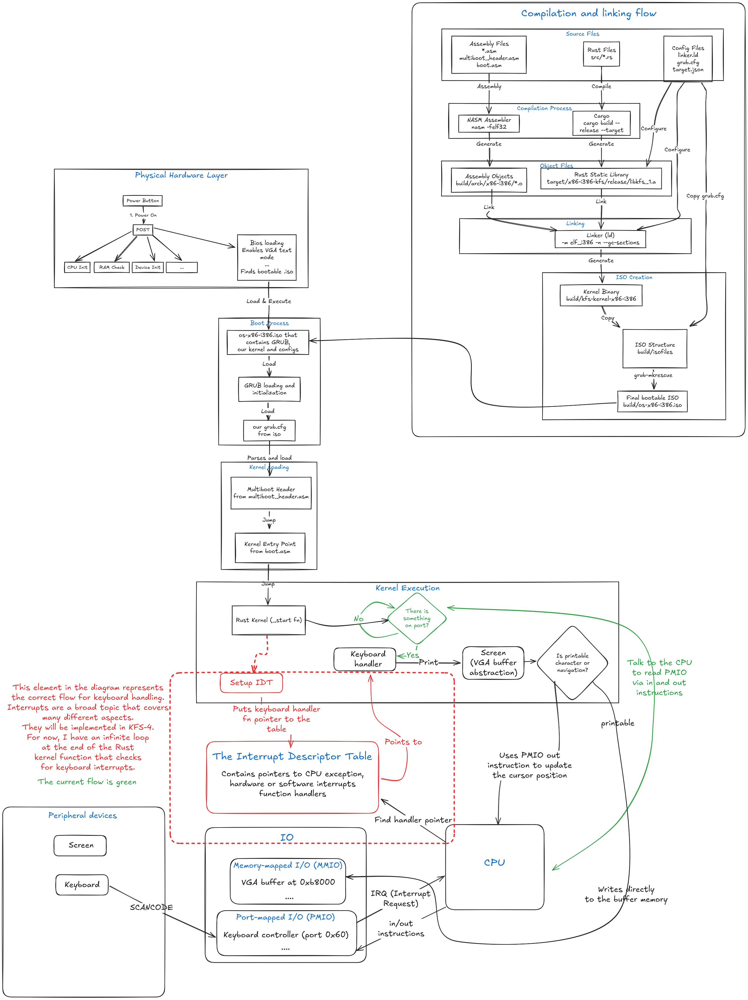

# Kernel from Scratch

## Overview



## Versions

The progress is attached to School 42 series of projects:

- [x] KFS-1 [branch](https://github.com/Obito-git/kfs/tree/kfs-1)
- [ ] KFS-2
- [ ] KFS-3
- [ ] KFS-4
- [ ] KFS-5
- [ ] KFS-6
- [ ] KFS-7
- [ ] KFS-8
- [ ] KFS-9
- [ ] KFS-x

## Dependencies

### Rust Toolchain

Required Rust components:

```shell
rustc 1.84.0-nightly (8adb4b30f 2024-11-13)
cargo 1.84.0-nightly (4a2d8dc63 2024-11-09)
```

The project specifically requires the nightly toolchain for advanced compiler features needed in kernel development.

### Build Tools

- `make` - Build automation tool used for orchestrating the compilation process
- `ld` (GNU linker) - Links the compiled Rust static library with assembly objects into the final kernel binary
- `nasm` - Netwide Assembler for compiling x86 assembly files

### Bootloader & ISO Creation

- `grub-mkrescue` - Creates bootable ISO images
- `xorriso` - Required by grub-mkrescue for ISO generation
- `grub2` - For multiboot2 support

### Emulation

- `qemu-system-i386` - x86 system emulator for testing the kernel
    - Provides virtual hardware environment
    - Supports direct booting from ISO images
    - Enables debugging and development without real hardware

### Optional Development Tools

- GDB (GNU Debugger) - For kernel debugging
- QEMU's built-in monitor - For system state inspection

Installation on Ubuntu/Debian:

```shell
apt install make nasm grub2 xorriso qemu-system-x86 build-essential
```

## Project Structure

### Architecture-Specific Code

```
/arch/* - Architecture-specific source files
└── /arch/x86-i386/ - Intel x86 32-bit implementation
```

#### Core Architecture Files

##### multiboot_header.asm

The Multiboot2 header file that allows GRUB2 to recognize and load the kernel. It includes:

- Magic number identifier for Multiboot2 (0xe85250d6)
- Architecture specification (protected mode i386)
- Header length calculation
- Checksum verification
- Required end tags for Multiboot2 compliance

##### boot.asm

The initial boot assembly code that:

- Sets up the 32-bit execution environment
- Provides the entry point (`start`) for the kernel
- Calls the Rust `_start` function
- Contains a simple test routine that writes "BYE" to the screen using VGA text mode
- Halts the CPU after execution

##### grub.cfg

GRUB2 bootloader configuration file that:

- Disables the boot menu timeout (timeout=0)
- Sets the default boot entry
- Creates a menu entry "kfs os" that:
    - Uses multiboot2 protocol to load the kernel
    - Specifies the kernel binary location (/boot/kfs.bin)

##### linker.ld

Linker script that defines the memory layout of the kernel:

- Places the kernel at 1MB physical address
- Ensures proper alignment of sections (4K alignment for .boot)
- Maintains the multiboot header at the start of the binary
- Defines text section placement
- Preserves the multiboot header using KEEP directive

##### x86-i386-kfs.json

Rust target specification file that defines the compilation environment:

- Sets up i386 architecture targeting
- Configures memory and data layouts
- Disables SIMD instructions (MMX, SSE)
- Enables soft float for floating-point operations
- Sets up linking parameters
- Configures panic handling (abort strategy)
- Disables red zone optimization for better kernel-mode operation

### Rust Sources

#### /.cargo/config.toml

Configuration file for Rust's build system that:

- Enables building core language features from source
- Configures the `build-std` option to include:
    - `core` - Rust's core library
    - `compiler_builtins` - Low-level compiler primitives
- Enables memory-related compiler builtins through `compiler-builtins-mem`

#### /src

Contains the Rust source code that will be compiled into a static library. This includes the kernel's core functionality
written in Rust.

#### rust-toolchain

A manifest file that enforces the use of Rust's nightly compiler.

#### Cargo.toml

The main Rust package manifest that defines:

- Project dependencies
- Build configurations
- Package metadata
- Target specifications

### Build System

#### /build

Output directory that contains compiled files and final artifacts:

##### /build/arch/*

Contains architecture-specific compiled objects:

- `.o` files compiled from assembly sources
- Example: `multiboot_header.o`, compiled from `multiboot_header.asm`

##### /build (root)

Contains final output files:

- `kfs-kernel-$(arch)` - The compiled kernel binary (e.g., `kfs-kernel-x86-i386`)
- `os-$(arch).iso` - The bootable ISO image (e.g., `os-x86-i386.iso`)

### Documentation

The `/docs` directory contains:

- `kfs*.excalidraw` - Source files for diagrams and illustrations created with Excalidraw
- `kfs*.png` - Generated PNG images used in the project's README
- Additional documentation files and resources as needed

## Usage

### Build Commands

- `make` - Builds the kernel and creates the ISO image
- `make run` - Builds (if needed) and launches the OS in QEMU
- `make rerun` - Performs a full clean rebuild and launches in QEMU

### Cleaning Commands

- `make clean` - Removes compiled objects and cleans Cargo artifacts
- `make fclean` - Performs a full cleanup, removing all build artifacts including the ISO

### Development Workflow

1. Use `make` for building during development
2. Use `make run` to test your changes
3. Use `make rerun` when you need a fresh build
4. Use `make clean` or `make fclean` when you need to clean up the build environment

## Project Requirements Status

### Core Requirements

- [x] Implement a complete Makefile for the project
- [x] Create and use a custom linker script (.ld)
- [x] Target i386 (x86) architecture
- [x] Final image size must not exceed 10 MB (current: ~ 3 MB)

### Boot Process

- [x] Create bootable kernel with GRUB
- [x] Install GRUB on virtual image
- [x] Implement ASM boot code with multiboot header
- [x] Use GRUB to initialize and call kernel's main function

### Kernel Development

- [x] Write basic kernel code in chosen language (Rust)
- [x] Compile with appropriate flags
- [x] Link components to create bootable binary

### I/O Interface

- [x] Implement VGA screen interface (VgaScreen and VgaScreenManager)
- [x] Successfully display "42" on screen
- [x] Add scroll support
- [x] Add cursor support
- [x] Implement color support
- [x] Create printf/printk helpers (implemented as Rust print/println macros)

### Input & Multi-screen Support

- [x] Handle keyboard input and display characters
- [x] Implement multiple screen support (3 screens)
- [x] Add keyboard shortcuts for screen switching (Ctrl+1, Ctrl+2, Ctrl+3)

### Build System

- [x] Configure Makefile to handle multiple languages (ASM + Rust)
- [x] Properly link all object files into final kernel binary
- [x] Set appropriate compiler flags for each language

## References

### General

- https://os.phil-opp.com/edition-1/
- https://os.phil-opp.com/minimal-rust-kernel/
- https://wiki.osdev.org/Expanded_Main_Page

### Cursor

- https://wiki.osdev.org/Text_Mode_Cursor

### VGA Text Mode

- https://en.wikipedia.org/wiki/VGA_text_mode

### Global descriptor table
- history (good introduction) until 13:00 https://www.youtube.com/watch?v=EBdzWFyKZ0U&t=30s
- tutorial https://wiki.osdev.org/GDT_Tutorial
- wiki https://en.wikipedia.org/wiki/Protected_mode