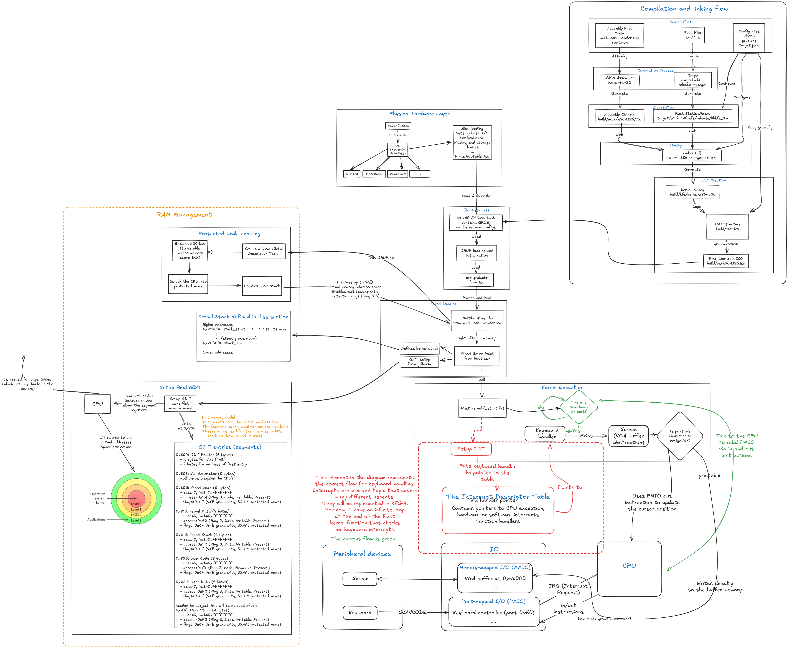

# Kernel from Scratch

## Overview



## Versions

The progress is attached to School 42 series of projects:

- [x] KFS-1 [branch](https://github.com/Obito-git/kfs/tree/kfs-1)
- [x] KFS-2 [branch](https://github.com/Obito-git/kfs/tree/kfs-2)
- [ ] KFS-3
- [ ] KFS-4
- [ ] KFS-5
- [ ] KFS-6
- [ ] KFS-7
- [ ] KFS-8
- [ ] KFS-9
- [ ] KFS-x

## Dependencies

### Rust Toolchain

Required Rust components:

```shell
rustc 1.84.0-nightly (8adb4b30f 2024-11-13)
cargo 1.84.0-nightly (4a2d8dc63 2024-11-09)
```

The project specifically requires the nightly toolchain for advanced compiler features needed in kernel development.

### Build Tools

- `make` - Build automation tool used for orchestrating the compilation process
- `ld` (GNU linker) - Links the compiled Rust static library with assembly objects into the final kernel binary
- `nasm` - Netwide Assembler for compiling x86 assembly files

### Bootloader & ISO Creation

- `grub-mkrescue` - Creates bootable ISO images
- `xorriso` - Required by grub-mkrescue for ISO generation
- `grub2` - For multiboot2 support

### Emulation

- `qemu-system-i386` - x86 system emulator for testing the kernel
    - Provides virtual hardware environment
    - Supports direct booting from ISO images
    - Enables debugging and development without real hardware

### Optional Development Tools

- GDB (GNU Debugger) - For kernel debugging
- QEMU's built-in monitor - For system state inspection

Installation on Ubuntu/Debian:

```shell
apt install make nasm grub2 xorriso qemu-system-x86 build-essential
```

## Project Structure

### Architecture-Specific Code

```
/arch/* - Architecture-specific source files
└── /arch/x86-i386/ - Intel x86 32-bit implementation
```

#### Core Architecture Files

##### multiboot_header.asm

The Multiboot2 header file that allows GRUB2 to recognize and load the kernel. It includes:

- Magic number identifier for Multiboot2 (0xe85250d6)
- Architecture specification (protected mode i386)
- Header length calculation
- Checksum verification
- Required end tags for Multiboot2 compliance

Before passing control to our kernel, GRUB sets up basic execution environment:

- Basic Global Descriptor Table (GDT):
    - Initial segmentation setup allowing memory protection
    - Basic code and data segments
    - Used until kernel sets up its own GDT

- Basic Stack:
    - Initial stack space allocation
    - Sets up stack pointer (ESP)
    - Enables function calls and local variables

Enables crucial CPU features:

- Protected Mode:
    - Enables memory protection and virtual memory
    - Provides privilege levels (Ring 0-3) to separate kernel and user code
    - Allows access to 32-bit instructions and addressing

- A20 Line:
    - Enables access to memory above 1MB
    - Removes the 1MB wraparound limitation from real mode
    - Required for proper memory addressing in protected mode

##### gdt.asm

Global Descriptor Table (GDT) setup file placed at memory address 0x800 (required by subject). Contains:

GDT Pointer Structure:

- 2-byte size field (GDT size minus 1)
- 4-byte address field pointing to GDT start

GDT Entries (8 bytes each):

1. Null Descriptor (Required by CPU)

- All zeros, used for error detection

2. Kernel Code Segment (0x08)

- Ring 0 privileges
- Executable code access
- Full 32-bit address space (4GB)

3. Kernel Data Segment (0x10)

- Ring 0 privileges
- Read/write data access
- Full 32-bit address space (4GB)

4. Kernel Stack Segment (0x18)

- Ring 0 privileges
- Read/write access
- Full 32-bit address space (4GB)

5. User Code Segment (0x20)

- Ring 3 privileges
- Executable code access
- Full 32-bit address space (4GB)

6. User Data Segment (0x30)

- Ring 3 privileges
- Read/write data access
- Full 32-bit address space (4GB)

Each segment entry includes:

- Base address (where segment starts)
- Limit (segment size)
- Access rights (privileges and permissions)
- Flags (granularity and operating mode)

GDT Loading Process:

- Uses LGDT instruction to load GDT pointer
- Updates segment registers (DS, ES, FS, GS, SS)
- Performs far jump to reload CS register
- Establishes new segmentation rules

Note: All segments cover the full 4GB address space, but actual memory access is controlled by privilege levels (Ring 0
vs Ring 3) and later by paging.

##### boot.asm

The boot assembly file that handles initial kernel setup:

Entry Point and Stack Setup:

- Provides global `start` entry point
- Reserves 1MB (4096 * 256 bytes) of aligned stack space
- Initializes stack pointer (ESP) to stack_start
- Stack grows downward from stack_start to stack_end

Initialization Sequence:

1. Sets up initial stack for kernel operations
2. Loads custom Global Descriptor Table (GDT)
3. Transfers control to Rust code via `_start`
4. Halts CPU if Rust code returns

Memory Organization:

- Stack space is aligned to 4KB boundary
- stack_start: Higher memory address (stack top)
- stack_end: Lower memory address (stack bottom)
- 1MB total stack space reserved

Exports:

- start: Entry point symbol for linker
- stack_end: Lower stack boundary
- stack_start: Upper stack boundary

##### grub.cfg

GRUB2 bootloader configuration file that:

- Sets the boot menu timeout (timeout=10)
- Sets the default boot entry
- Creates a menu entry "kfs os" that:
    - Uses multiboot2 protocol to load the kernel
    - Specifies the kernel binary location (/boot/kfs.bin)
- Creates a menu entry "other os" that:
    - Points to our kernel, but demonstrates what exactly entry does

##### linker.ld

Linker script that defines the complete memory layout of the kernel:

Physical Memory Layout:

1. GDT Section (0x800)

- Places Global Descriptor Table at fixed address 0x800
- Contains CPU memory segmentation rules
- Must be accessible early in boot process

2. Kernel Space (Starting at 1MB/0x100000)

- Boot Section (.boot)
    - Contains Multiboot2 header
    - 4KB aligned for memory management
    - Protected from garbage collection (KEEP directive)

- Code Section (.text)
    - Contains executable code
    - 4KB aligned for memory protection
    - Includes kernel instructions

- Uninitialized Data Section (.bss)
    - Contains zero-initialized data
    - 4KB aligned for memory management
    - Includes kernel stack space

Key Features:

- Entry point defined as 'start' symbol
- Strategic section alignment (4KB) for:
- Page-level memory protection
- Efficient memory access
- Virtual memory management
- Clear separation between different memory regions
- Proper placement of boot-critical structures (GDT, Multiboot header)

Memory Map Overview:
0x00000800: GDT
0x00100000: Multiboot Header (.boot)
0x00101000: Kernel Code (.text)
0x00102000: BSS Section (.bss)

This layout ensures proper kernel initialization and memory organization for protected mode operation.

##### x86-i386-kfs.json

Rust target specification file that defines the compilation environment:

- Sets up i386 architecture targeting
- Configures memory and data layouts
- Disables SIMD instructions (MMX, SSE)
- Enables soft float for floating-point operations
- Sets up linking parameters
- Configures panic handling (abort strategy)
- Disables red zone optimization for better kernel-mode operation

### Rust Sources

#### /.cargo/config.toml

Configuration file for Rust's build system that:

- Enables building core language features from source
- Configures the `build-std` option to include:
    - `core` - Rust's core library
    - `compiler_builtins` - Low-level compiler primitives
- Enables memory-related compiler builtins through `compiler-builtins-mem`

#### /src

Contains the Rust source code that will be compiled into a static library. This includes the kernel's core functionality
written in Rust.

#### rust-toolchain

A manifest file that enforces the use of Rust's nightly compiler.

#### Cargo.toml

The main Rust package manifest that defines:

- Project dependencies
- Build configurations
- Package metadata
- Target specifications

### Build System

#### /build

Output directory that contains compiled files and final artifacts:

##### /build/arch/*

Contains architecture-specific compiled objects:

- `.o` files compiled from assembly sources
- Example: `multiboot_header.o`, compiled from `multiboot_header.asm`

##### /build (root)

Contains final output files:

- `kfs-kernel-$(arch)` - The compiled kernel binary (e.g., `kfs-kernel-x86-i386`)
- `os-$(arch).iso` - The bootable ISO image (e.g., `os-x86-i386.iso`)

### Documentation

The `/docs` directory contains:

- `kfs*.excalidraw` - Source files for diagrams and illustrations created with Excalidraw
- `kfs*.png` - Generated PNG images used in the project's README
- Additional documentation files and resources as needed

## Usage

### Build Commands

- `make` - Builds the kernel and creates the ISO image
- `make run` - Builds (if needed) and launches the OS in QEMU
- `make rerun` - Performs a full clean rebuild and launches in QEMU

### Cleaning Commands

- `make clean` - Removes compiled objects and cleans Cargo artifacts
- `make fclean` - Performs a full cleanup, removing all build artifacts including the ISO

### Development Workflow

1. Use `make` for building during development
2. Use `make run` to test your changes
3. Use `make rerun` when you need a fresh build
4. Use `make clean` or `make fclean` when you need to clean up the build environment

## Project Requirements Status

### Core Requirements

#### Kfs-1

- [x] Implement a complete Makefile for the project
- [x] Create and use a custom linker script (.ld)
- [x] Target i386 (x86) architecture
- [x] Final image size must not exceed 10 MB (current: ~ 3 MB)

#### Kfs-2

The ISO file must not exceed 10MB in size. While building at home, it unexpectedly grew to 16MB, though it remained at
3MB when building at school. To address this issue, I explicitly removed GRUB fonts and themes in the Makefile to reduce
the size.

### Boot Process

#### Kfs-1

- [x] Create bootable kernel with GRUB
- [x] Install GRUB on virtual image
- [x] Implement ASM boot code with multiboot header
- [x] Use GRUB to initialize and call kernel's main function

### Kernel Development

#### Kfs-1

- [x] Write basic kernel code in chosen language (Rust)
- [x] Compile with appropriate flags
- [x] Link components to create bootable binary

#### Kfs-2

Global Descriptor Table:

- [x] Create Global Descriptor Table
- [x] Place GDT at address 0x00000800
- [x] Declare GDT to BIOS using LGDT instruction

GDT Entries:

- [x] Kernel Code segment
- [x] Kernel Data segment
- [x] Kernel Stack segment
- [x] User Code segment
- [x] User Data segment
- [x] User Stack segment

### I/O Interface

#### Kfs-1

- [x] Implement VGA screen interface (VgaScreen and VgaScreenManager)
- [x] Successfully display "42" on screen
- [x] Add scroll support
- [x] Add cursor support
- [x] Implement color support
- [x] Create printf/printk helpers (implemented as Rust print/println macros)

#### Kfs-2

Two commands are implemented to examine kernel stack contents:

##### pks (Print Kernel Stack), require by subject

- Basic stack hex dump utility
- Shows raw stack memory from ESP upward
- Displays both hex values and ASCII representation
- Compresses repeated lines with "*" notation

##### pts (Print Test Stack), demonstration tool

- Uses test patterns
- Places recognizable data on stack before dumping:

1. ASCII string "HELLO FROM STACK!" (visible in right column)
2. 32-bit value 0xDEADBEEF (in little-endian, what shows EF BE AD DE)
3. Byte array [DE AD BE EF] (in direct order)

- Helps validate stack functionality by:
- Confirming stack write operations
- Demonstrating stack memory layout
- Showing data alignment patterns
- Verifying ASCII representation

### Input & Multi-screen Support

#### Kfs-1

- [x] Handle keyboard input and display characters
- [x] Implement multiple screen support (3 screens)
- [x] Add keyboard shortcuts for screen switching (Ctrl+1, Ctrl+2, Ctrl+3)

#### Kfs-2

- [x] Create a basic shell (not the POSIX one)
- [x] Implement commands:
- [x] reboot
- [x] clear
- [x] poweroff

### Build System

#### Kfs-1

- [x] Configure Makefile to handle multiple languages (ASM + Rust)
- [x] Properly link all object files into final kernel binary
- [x] Set appropriate compiler flags for each language

## References

### General

- https://os.phil-opp.com/edition-1/
- https://os.phil-opp.com/minimal-rust-kernel/
- https://wiki.osdev.org/Expanded_Main_Page

### Cursor

- https://wiki.osdev.org/Text_Mode_Cursor

### VGA Text Mode

- https://en.wikipedia.org/wiki/VGA_text_mode

### Global descriptor table

- history (good introduction) until 13:00 https://www.youtube.com/watch?v=EBdzWFyKZ0U&t=30s
- tutorial https://wiki.osdev.org/GDT_Tutorial
- wiki https://en.wikipedia.org/wiki/Protected_mode
- https://www.youtube.com/watch?v=Wh5nPn2U_1w&t=308s
- https://www.youtube.com/watch?v=jwulDRMQ53I